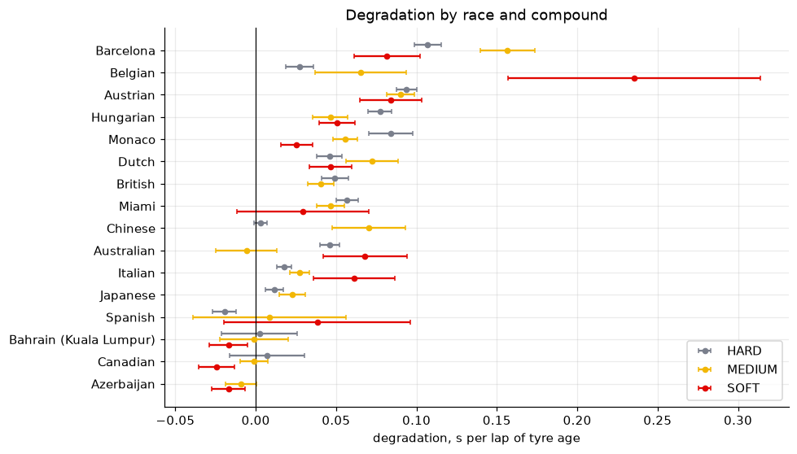
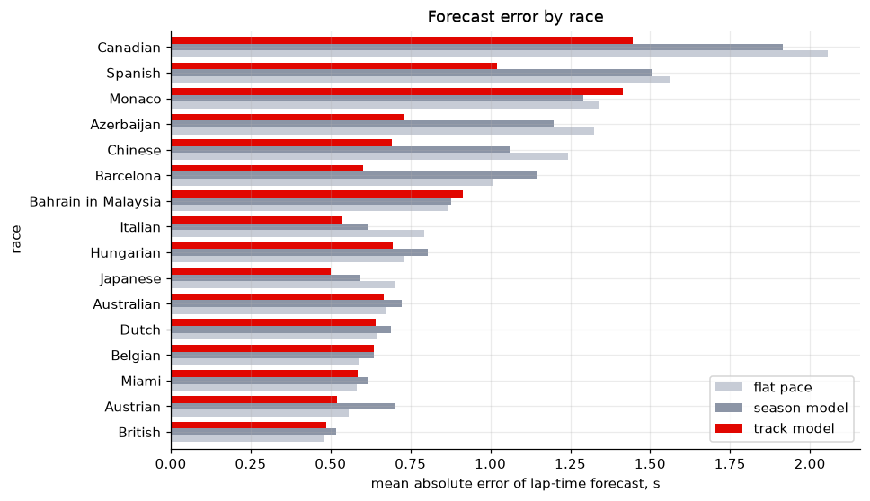
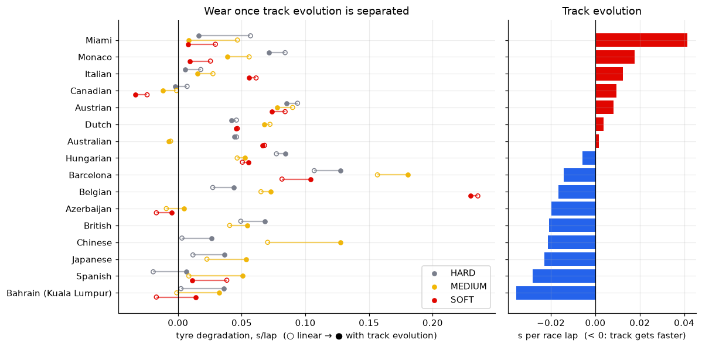
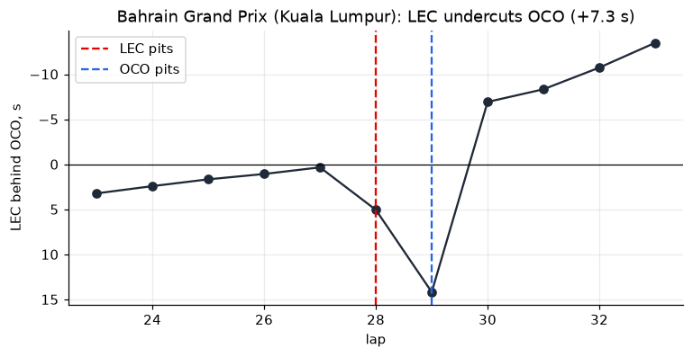
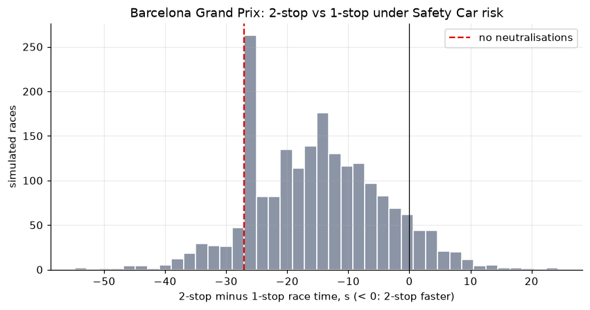
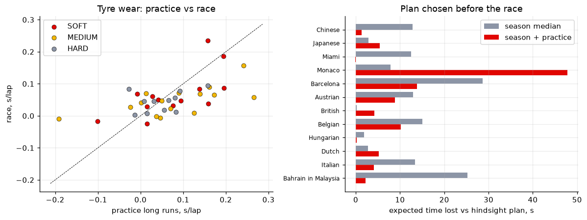

# F1 Tyre Degradation & Pit-Stop Strategy

[](https://github.com/emrickre/f1-analytics/actions/workflows/tests.yml)

How fast do Formula 1 tyres degrade in the 2026 season, does it depend on the compound
or on the track, and when is the optimal moment to pit?

📓 **[Read the analysis → notebooks/tyre_degradation.ipynb](notebooks/tyre_degradation.ipynb)**

## Key findings

- **Degradation is a property of the track, not of the compound.** Fitted race by race,
  degradation ranges from −0.013 to 0.150 s/lap between tracks. Within the same race the median
  SOFT − MEDIUM difference is only −0.006 s/lap, and the soft wears faster in just 6 of 13 races.
- **Simpson's paradox in the naive model.** A season-wide mixed model says SOFT wears slower
  than MEDIUM (0.024 vs 0.033 s/lap). The reason is that teams run softs mostly on low-wear tracks.
- **What a strategist can predict.** After 3 laps of a stint, estimating degradation from the
  *other drivers in the same race* cuts the lap-time forecast error by **20 %** (MAE 0.76 s vs
  0.96 s for a flat-pace baseline). A season-average model gains only 1 %. The track model wins
  in 11 of 16 races.
- **Belgian GP case.** The model's optimal one-stop lap (16, window 12–20) matches the laps the
  teams actually chose (14–17).
- **Beyond a linear model.** A track-specific quadratic wear curve cuts the forecast error further,
  to **24 %** (MAE 0.72 s). Separating track evolution (the track typically gets 0.01 s/lap faster)
  changes how wear is read on some tracks, but it neither improves the forecast nor makes the
  pit-window choice more reliable, so strategy keeps the simpler model.







## Data

Every race lap of the 2026 season from the [OpenF1](https://openf1.org) API: lap and sector
times, tyre compound and age, pit stops, Safety Car / VSC / flags, track temperature.
18,405 laps from 16 races, 14,274 after cleaning. The dataset is included in
[`data/laps_2026.parquet`](data/laps_2026.parquet); it is derived from OpenF1 data and shared under
the same license (see [License](#license)). OpenF1's stint table does not always match its pit
stops (shifted by a lap in some races, missing stops in others), so tyre stints are rebuilt from the
pit stops, with each stop lap checked against the pit-exit time.
Practice and sprint laps of the same weekends (21,776 laps from 43 sessions) are in
[`data/laps_2026_practice.parquet`](data/laps_2026_practice.parquet).

## Method

1. **Load**: `analysis/dataset.py` builds one row per lap per driver from the OpenF1 tables.
2. **Clean**: `analysis/clean.py` drops start laps, pit in/out laps, neutralised laps, yellow
   flags, wet running, outliers (>107 % of the driver's median) and short stints, and records
   the reason for each.
3. **Model**: `analysis/model.py` fits a linear mixed model
   `lap_time ~ compound + compound:tyre_age + fuel + track_temperature` over the season, and
   per-race models with a fixed season fuel effect (0.045 s per lap of fuel).
4. **Validate**: lap-time forecasts with leave-one-race-out and leave-one-driver-out splits;
   per-race variants with a track-evolution term (`lap_number`) and quadratic wear are compared
   on the same task.
5. **Strategy**: `analysis/strategy.py` computes measured pit loss, the one-stop race-time
   curve, the optimal window and the undercut gain.

Limitations (linear wear, track evolution vs. wear, no traffic model) are discussed at the end
of the notebook.

## How to run

Requires Python 3.10 or newer.

```bash
python -m venv venv && source venv/bin/activate
pip install -r requirements-analysis.txt
jupyter notebook notebooks/tyre_degradation.ipynb
```

The notebook runs offline on the included dataset (about 15 s). To rebuild the dataset from
the API (about 3 min; OpenF1 is closed to free users while a session is live):

```bash
python -m analysis.dataset 2026
python -m analysis.dataset 2026 --session practice   # FP1–FP3 and sprints
```

Tests: `python -m unittest discover tests`

## Second study: the undercut

📓 **[notebooks/undercut.ipynb](notebooks/undercut.ipynb)**: how much does pitting before a rival
actually gain? Gaps between cars are reconstructed from line-crossing times (checked against
OpenF1's interval feed: median difference 0.1 s), giving 132 pit-stop pairs in 14 races.

- Pitting first gains **+2.8 s** on average (95 % CI 2.1–3.2 s, bootstrap over races) and gains
  time in 81 % of pairs.
- **Track degradation drives it**: 0.1 s/lap more wear makes the undercut worth ~2.7 s more.
  Every lap the rival stays out adds ~0.5 s; every extra second in the pit lane costs ~1.3 s.
- As an overtaking move it works from within 2 s in ~60 % of cases, from 3–5 s back in only 9 %.
- The tyre model from the first study predicts the gain without bias but only roughly
  (correlation 0.48): traffic and driver effects are not in the data.



## Third study: strategy under Safety Car risk

📓 **[notebooks/strategy_sim.ipynb](notebooks/strategy_sim.ipynb)**: a Monte Carlo race simulator
that combines the per-track wear model with a Safety Car / VSC model fitted on the season.

- Every 2026 race had a neutralisation: 2.0 per race on average, 31 % of them full Safety Cars.
  A stop costs ~50 % of its usual price under a Safety Car and ~84 % under a VSC.
- Safety Car risk shrinks the advantage of a two-stop by a median 44 % where it clearly wins
  (Barcelona: 27.0 s → 15.1 s): fresh tyres gain nothing on neutralised laps, and a one-stopper can
  take a cheap extra stop.
- Reacting to a neutralisation (moving a stop or adding one when it pays) is worth 1.3 s per race
  on average, up to 5 s on high-wear tracks.
- Replaying each race's real Safety Car periods, the model makes the same number of stops as most
  drivers in 9 of 11 dry races.



**Planning from practice.** The simulator above knows each race's tyre wear in hindsight. Before the
start a strategist only has free practice and the sprint, so the same notebook estimates wear from
442 practice long runs. Raw practice wear tracks the race (r = 0.59) but runs high and noisy. Shrunk
towards the season median (empirical Bayes, leave-one-race-out), it forecasts race wear 14 % better
than the season median alone. It also gives a better pre-race plan in 8 of 12 races: the median time
lost against a hindsight plan falls from 12.7 s to 4.7 s. Monaco is the exception: three FP1 runs on
a green track mistook track grip for tyre life.



## Also in this repo

- **Live timing web app** ([`live/`](live/README.md)): race replay with timing tower, track
  map, car telemetry and an in-race strategy tab built on the studies above. It learns tyre
  degradation from the laps completed so far and starts from a practice-based forecast. It shows
  the Safety Car risk, and under a Safety Car or VSC it says whether to box now. `pip install -r requirements-live.txt && python -m live openf1`
- **Session explorer** (`app.py`, `main.py`, `f1_data.py`, `plots.py`): a Tkinter app and CLI
  with lap times, fastest-lap telemetry, positions, tyre strategy and lap-time distribution for
  any session since 2023. Data comes from OpenF1 as FastF1-like tables, because FastF1's source
  (livetiming.formula1.com) is blocked on many networks.
  ```bash
  pip install -r requirements.txt
  python app.py                                   # GUI
  python main.py 2024 "Las Vegas" R NOR PIA      # save all plots to figures/
  ```

## License

- **Code**: [MIT](LICENSE).
- **Data**: lap data comes from [OpenF1](https://openf1.org), licensed under
  [CC BY-NC-SA 4.0](https://creativecommons.org/licenses/by-nc-sa/4.0/). The derived dataset in
  `data/` is shared under the same terms: non-commercial use, with attribution to OpenF1.

This is a personal, non-commercial project. It is not associated with Formula 1 or any of its
companies; F1, FORMULA 1 and related marks are trademarks of Formula One Licensing B.V.
